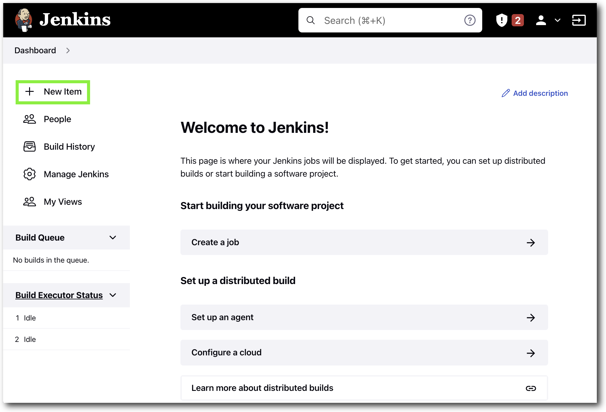
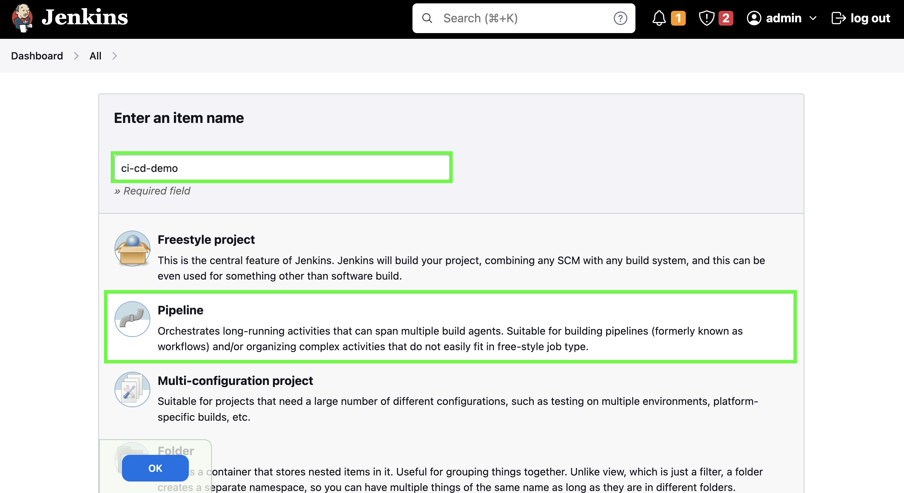
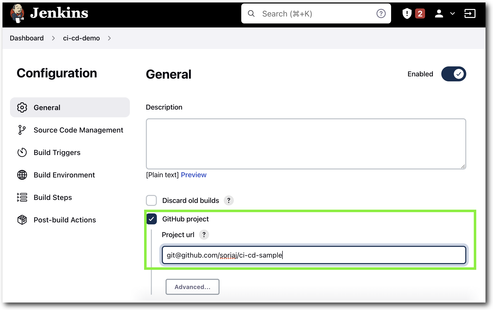
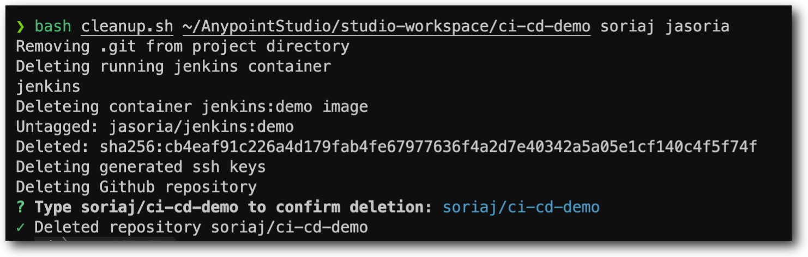

# CI/CD Demo
## What Does This Do
The script automates the following in order to demo a CI/CD workflow for deploying Mule apps into CloudHub.
1. Creation of a Private Github repository based on the Anypoint project directory provided.
2. Generates and configures Github deploy keys, used for communication with Jenkins.
3. Creates and configures a Jenkins container image that is used to listen to a configured GitHub repository for deployments to CloudHub.
4. Jenkinsfile will checkout, build, test, and deploy application to Sandbox and Production.

> **NOTE:** Production deployment is optional. Edit/Remove Jenkinsfile stages that are not used/needed
> If configurating functional monitoring, you will need your application endpoint url.
>  
# Pre-requisites
In order to run the script you will need the following:

- Anypoint Studio and Platform Account 
- Docker Desktop or Rancher Desktop
- Git
- Github CLI and Github Personal Access Token
- The files in this repo

> **NOTE**: This has only been tested on Mac OS  system.
# Pre-script Setup
- Create a new Anypoint Studio Project
- Install Git and Github CLI
  - Run `brew install git gh`
- Github Personal Access Token
  - See [Creating a personal access token](https://docs.github.com/en/authentication/keeping-your-account-and-data-secure/creating-a-personal-access-token) for additional informaiton.
    - Set and select the following for your Personal Access Token:
      - Note: **NAME_YOUR_TOKEN**
      - Expiration: **SET_DURATION**
      - Select the **repo** checkbox
      - Select the **delete_repo** checkbox
      - Click **Generate token**
    - Copy the generated token and set it as an environment variable on your system 
      - `echo GITHUB_TOKEN={YOUR_TOKEN} >> ~/.bashrc` or `~/.zshrc`
      - Run `source ~/.basrc` or `source ~/.zshrc` to update current terminal session.

    <br>

    > **Alternative Method**
    > - As an alternative you can use `gh auth login` to create a temporary token. 
    > - To run the cleanup script you will need you will need to run `gh auth refresh -h github.com -s delete_repo` in order to add delete repository capabilities.

<br>

- Install Docker Desktop
  - See [Docker Desktop download](https://www.docker.com/products/docker-desktop/) or [Rancher Desktop](https://rancherdesktop.io/)


# Running the Script
1. Before runing the script you will need to have your `GITHUB_TOKEN` set in `~/.bashrc` or `~/.zshrc`. See **Github Personal Access Token** or **Alternative Method**. 
2. Edit the `casc.yaml` and set your Anypoint `username` and `password` or edit afterwards within Jenkins (Configure > Credentials, select credential and click **Update**)
```yaml
          - string:
              scope: GLOBAL
              id: "username"
              secret: "${ANYPOINT_USERNAME}"
              description: "Anypoint Username"
          - string:
              scope: GLOBAL
              id: "password"
              secret: "${ANYPOINT_PASSWORD}"
              description: "Anypoint Password"
```

3. Edit the `Jenkinsfile` and add your github username in the **Declarative: Checkout SCM** stage.

**Example:**
```bash
stage('Declarative: Checkout SCM'){
       steps {
           git branch: 'main', credentialsId: 'jenkins_ssh', url: 'git@github.com:{GITHUB_USERNAME}/PATH.git'
       }
    }
```

4. The `cicd-demo.sh` script takes three arguments. The first is the path to your Mule app (e.g. `~/AnypointStudio/studio-workspace/ci-cd-sample`). Second is your Github username. Third is any name, preferably your dockerhub username as this name is used to create the container image. e.g. `jasoria/jenkins:demo`).

Run the script as follows:

```sh
bash cicd-demo.sh ${PATH_TO_MULE_PROJECT} ${GITHUB_USERNAME} ${DOCKERHUB_USERNAME}
```

> **NOTE**: Nexus EE repository is configured in the [`settings.xml`](.maven/settings.xml). Validate you have access prior to deploying. The setup script will copy the pre-configured `settings.xml` to your Studio project.
> 
> Additionally update your `pom.xml` for Cloudhub 2.0 deployment and OrgId in the `<groupId>` section. 
> 
> See [Configure the CloudHub Deployment Strategy](https://docs.mulesoft.com/mule-runtime/4.4/deploy-to-cloudhub#configure-the-cloudhub-deployment-strategy) for more information on deployment strategies. 
> 
> Examples: See [cloudhub-1.0-pom.xml](cloudhub-1.0-pom.xml) or [cloudhub-2.0-pom.xml](cloudhub-2.0-pom.xml) or snippet below.
> 
> 
> <details>
>  <summary>Click here to see Cloudhub 2.0 pom.xml snippet</summary>
> 
>   ```xml
> <plugin>
>    <groupId>org.mule.tools.maven</groupId>
>    <artifactId>mule-maven-plugin</artifactId>
>    <version>${mule.maven.plugin.version}</version>
>    <extensions>true</extensions>
>    <configuration>
>      <cloudhub2Deployment>
>        <uri>https://anypoint.mulesoft.com</uri>
>        <provider>MC</provider>
>        <environment>${environment}</environment>
>        <target>${region}</target>
>        <muleVersion>${muleVersion}</muleVersion>
>        <server>PrivateExchangeRepository</server>
>        <username>${username}</username>
>        <password>${password}</password>
>        <applicationName>${appName}</applicationName>
>        <replicas>1</replicas>
>        <vCores>0.1</vCores>
>        <deploymentSettings>
>          <generateDefaultPublicUrl>true</generateDefaultPublicUrl>
>        </deploymentSettings>
>      </cloudhub2Deployment>
>    </configuration>
>  </plugin>
>   ```
>  NOTE: If using a trial account, Region and Workers (Quantity of workers) can be omitted and workerType will be MICRO. See example-pom.xml for a complete file.
>  </details>
>
> 
<br>

# Configuring Jenkins for App Deployment
## Configure and Deploy Job
1. Open your browser to [http://localhost:8080](http://localhost:8080) and login to Jenkins using `admin` and `password`.

2. From the Dashboard select **New Item**

3. Enter an item name, e.g. **ci-cd-demo** and select **Pipeline project**
 then click **OK**.
4. In the **Configuration** screen input the following information:
* a. In the **General** section select **Github project** 
* b. Enter the GitHub repository created by the script. e.g. Your project directory: `~/AnypointStudio/studio-workspace/ci-cd-sample`, Created GitHub repository: `git@github.com:soriaj/ci-cd-sample.git` or `https://github.com/soriaj/ci-cd-sample`into the **Project url** section.

5. In the **Build Triggers** section click the **Poll SCM** or **Github hook trigger for GITScm polling**.
> NOTE: If using GITScm polling a webhook will need to be setup between your server/system and Github
6.  In the **Pipeline** section select `Pipeline script` and copy and paste the content from the [Jenkinsfile](Jenkinsfile)
> NOTE: If you did not configure environment variables you can hardcode your username and password where required.
7. Update the `APP` name at the beginning of the `Jenkinsfile`
```
pipeline {
  agent any
  environment {
    MULE_VERSION = '4.5.2'
    APP = '${CHANGE_ME}'
    USER = credentials('username')
    PASSWORD = credentials('password')
  }
  ...
```
8. Update the `REGION` name for **Sandbox** and **Production** in the `Jenkinsfile`
```json
    stage('Deploy to Development') {
      environment {
        ENVIRONMENT = 'Sandbox'
        APP_NAME = 'sandbox-${APP}'
        REGION = '${CHANGE_ME}'
        ...
    
    stage('Deploy to Production') {
      environment {
        ENVIRONMENT = 'Production'
        APP_NAME = 'production-${APP}'
        REGION = '${CHANGE_ME}'
        ...
```
> CloubHub 2.0 Region Examples:
> - Cloudhub-US-West-1
> - Cloudhub-US-East-1
  
9. Remove the `post` stage sections in the `Jenkinsfile` if no MUnit tests or Integrations tests are used.

**Remove Example**:
```bash
      post {
          always {
            publishHTML (target: [
                          allowMissing: false,
                          alwaysLinkToLastBuild: false,
                          keepAll: true,
                          reportDir: 'target/site/munit/coverage',
                          reportFiles: 'summary.html',
                          reportName: "Code coverage"
                      ]
                    )
          }
        }
```
10. Save the Pipline.
11. Click on **Build Now**


# Post Demo Cleanup
The cleanup script will remove the running container, delete the created container image and prompt to delete the created Github Repo.
> NOTE: 
> - If you used the **Alternative Method** for creating a `GITHUB_TOKEN` you need to refresh your token to allow `delete_repo` permissions prior to running the script. Run `gh auth refresh -h github.com -s delete_repo` to update your token.
> - You will need to manually delete the CloudHub application. Login to [Anypoint Platform](https://anypoint.mulesoft.com)
> - Your project directory **will not** be deleted but `.git` will be removed from the directory.

To run the cleanup script you need to pass three arguements. The first is the path to your Mule app (e.g. `~/AnypointStudio/studio-workspace/ci-cd-sample`). Second, your GitHub username. Third the username used to create the container image.

Run:
```sh
bash cleanup.sh ${PATH_TO_MULE_PROJECT} ${GITHUB_USERNAME} ${DOCKERHUB_USERNAME}
```

When prompted enter the GitHub repository name (`soriaj/ci-cd-demo`) to confirm deletion.

Example output below:
