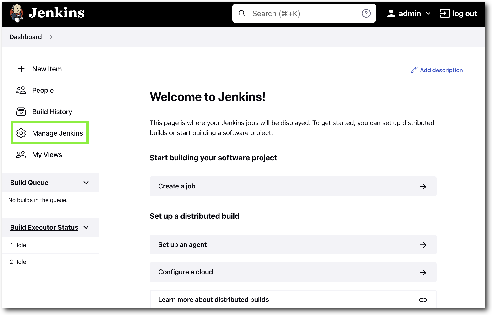

# CI-CD Demo
## What Does This Do
The script automates the followiing in order to demo a CI-CD workflow for deploying Mule apps into CloudHub.
1. Creation of a Github repository based on the Anypoint project directory provided
2. Generates and configures Github deploy keys, used for communication with Jenkins.
3. Creates and configures a Docker Jenkins with Maven container image that is used to listen for the Git repository for deployments to CloudHub.

# Pre-requisites
In order to run the script you will need the following:

- Anypoint Studio and Platform Account 
- Docker Desktop
- Git
- Github CLI and Github Personal Access Token
- The files in this repo
  - ```git
    git clone https://github.com/soriaj/ms-cicd-demo

    or with ssh

    git clone git@github.com:soriaj/ms-cicd-demo.git
    ```

# Pre-script Setup
- Create a new Anypoint Studio Project
- Install Git and Github CLI
  - Run `brew install git gh`
- Github Personal Access Token
  - See [Creating a personal access token](https://docs.github.com/en/authentication/keeping-your-account-and-data-secure/creating-a-personal-access-token) for additional informaiton.
    - Set and select the following for your Personal Access Token:
      - Note: **NAME_YOUR_TOKEN**
      - Expiration: **SET_DURATION**
      - Select the **repo** checkbox
      - Select the **delete_repo** checkbox
      - Click **Generate token**
    - Copy the generated token and set it as an environment variable on your system 
      - `echo GITHUB_TOKEN={YOUR_TOKEN} >> ~/.bashrc` or `~/.zshrc`
      - Run `source ~/.basrc` or `source ~/.zshrc` to update current terminal session.

    <br>

    > **Alternative Method**
    > - As an alternative you can use `gh auth login` to create a temporary token. 
    > - To run the cleanup script you will need you will need to run `gh auth refresh -h github.com -s delete_repo` in order to add delete repository capabilities.

<br>

- Install Docker Desktop
  - See [Docker Desktop download](https://www.docker.com/products/docker-desktop/)


# Running the Script
Before runing the script you will need to have your `GITHUB_TOKEN` set. See **Github Personal Access Token** or **Alternative Method**.

The `cicd-demo.sh` script takes three arguments. The first is the path to your Mule app (e.g. `~/AnypointStudio/studio-workspace/ci-cd-sample`). Second is your Github username. Third is any name, preferably your dockerhub username as this name is used to create the container image. e.g. `jasoria/jenkins:demo`).

Run the script as follows:

```sh
bash cicd-demo.sh ${PATH_TO_MULE_PROJECT} ${GITHUB_USERNAME} ${DOCKERHUB_USERNAME}
```

> NOTE: You will need to have your `pom.xml` configured to deploy into CloudHub. See [Configure the CloudHub Deployment Strategy](https://docs.mulesoft.com/mule-runtime/4.4/deploy-to-cloudhub#configure-the-cloudhub-deployment-strategy) for more information. See [example-pom.xml](example-pom.xml) or snippet below.
> 
> <details>
>  <summary>Click here to see pom.xml snippet</summary>
> 
>   ```xml
> <plugin>
>   <groupId>org.mule.tools.maven</groupId>
>   <artifactId>mule-maven-plugin</artifactId>
>   <version>${mule.maven.plugin.version}</version>
>   <extensions>true</extensions>
>   <configuration>
>     <cloudHubDeployment>
>       <uri>https://anypoint.mulesoft.com</uri>
>       <muleVersion>${muleVersion}</muleVersion>
>       <username>${username}</username>
>       <password>${password}</password>
>       <applicationName>${appName}</applicationName>
>       <environment>${environment}</environment>
>       <region>${region}</region>
>       <workers>${workers}</workers>
>       <workerType>${workerType}</workerType>
>     </cloudHubDeployment>
>   </configuration>
> </plugin>
>   ```
>  NOTE: If using a trial account, Region and Workers (Quantity of workers) can be omitted and workerType will be MICRO. See example-pom.xml for a complete file.
>  </details>

<br>

# Configuring Jenkins for App Deployment
## Configure Environment Variables (optional)
> This step is optional depending on preference as you can hard code variables in the `mvn deploy` command used later.
1. Open your browser to [http://localhost:8080](http://localhost:8080) and login to Jenkins using `admin` and `password`.
2. From the Dashboard select **Manage Jenkins**

3. Select **Configure System**

4. In Configure System page scroll down to the **Global properties** section and check **Environment variables**.
5. Under **List of variables** select **Add** and create a **USERNAME** and **PASSWORD** variables.

6. Click **Save** to apply the changes.

## Configure and Deploy Job
1. Open your browser to [http://localhost:8080](http://localhost:8080) and login to Jenkins using `admin` and `password`.

2. From the Dashboard select **New Item**

3. Enter an item name, e.g. **ci-cd-demo** and select **Freestyle project**

4. In the **Configuration** screen input the following information:
* a. In the **General** section select **Github project** 
* b. Enter the GitHub repository created by the script. e.g. Your project directory: `~/AnypointStudio/studio-workspace/ci-cd-sample`, Created GitHub repository: `git@github.com:soriaj/ci-cd-sample.git` into the **Project url** section.

5. In the **Source Code Management** section select **Git** and enter the same repository into **Repository URL**.

6. In the **Credentials** section select **jenkins** from the drop down.
7. Under the **Branches to build** section enter the **Branch Specifier** to match your GitHub branch. e.g. `master` or `main`.

8. In the **Build Triggers** section select **Poll SCM** and configure a cron schedule to run every minute. Enter `* * * * *` in the **Schedule** dialog box. 

9. In the **Build Steps** section click the **Add build step** drop down and select **Execute shell**.
10. Add the following to the **Command** dialog box:
```sh
mvn clean package deploy -DmuleDeploy -Dusername=$USERNAME -Dpassword=$PASSWORD -DmuleVersion=4.4.0 -Denvironment=Sandbox -DappName=$REPLACE_WITH_UNIQUE_APP_NAME -DworkerType=MICRO
```
> NOTE: If you did not configure environment variables you can hardcode your username and password where required.


11. Select **Save** to save the job.


# Post Demo Cleanup
The cleanup script will remove the running container, delete the created container image and prompt to delete the created Github Repo.
> NOTE: 
> - If you used the **Alternative Method** for creating a `GITHUB_TOKEN` you need to refresh your token to allow `delete_repo` permissions prior to running the script. Run `gh auth refresh -h github.com -s delete_repo` to update your token.
> - You will need to manually delete the CloudHub application. Login to [Anypoint Platform](https://anypoint.mulesoft.com)
> - Your project directory **will not** be deleted but `.git` will be removed from the directory.

To run the cleanup script you need to pass three arguements. The first is the path to your Mule app (e.g. `~/AnypointStudio/studio-workspace/ci-cd-sample`). Second, your GitHub username. Third the username used to create the container image.

Run:
```sh
bash cleanup.sh ${PATH_TO_MULE_PROJECT} ${GITHUB_USERNAME} ${DOCKERHUB_USERNAME}
```

When prompted enter the GitHub repository name to confirm deletion.

Example output below:
